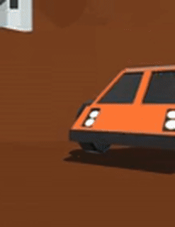

# Unity AR Portal

An **AR project** built with **Unity** where users can **walk through a virtual portal** into a digital world and **seamlessly return to the real world** through the same portal.

  
*Example of AR portal transition.*

---

## Features
- AR portal with smooth transition between **real** and **virtual** worlds.
- **Layer-based world switching** using camera culling masks instead of moving the player.
- Built on **custom Dependency Injection (DI)** for clean code structure.
- **State Machine** to manage application states and transitions.
- Works on both **iOS** and **Android** devices.
